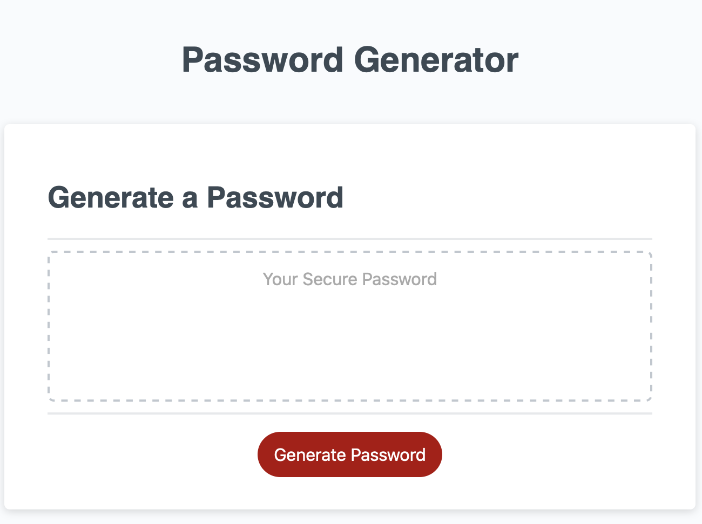
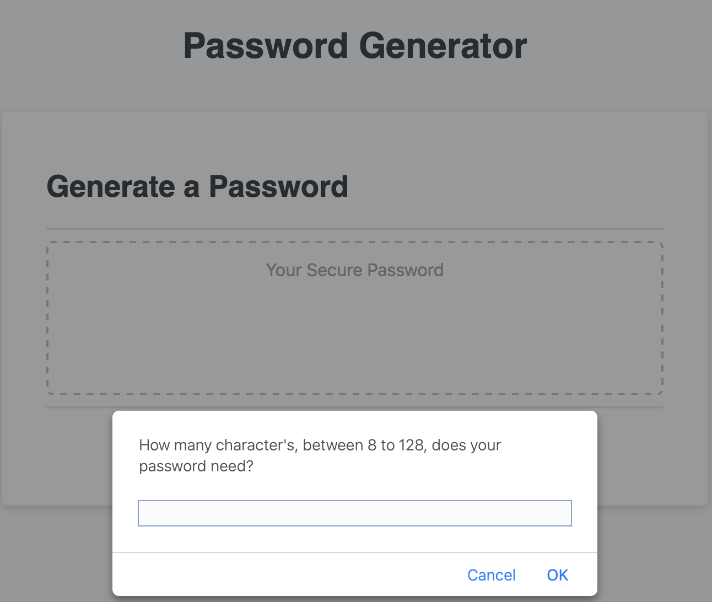
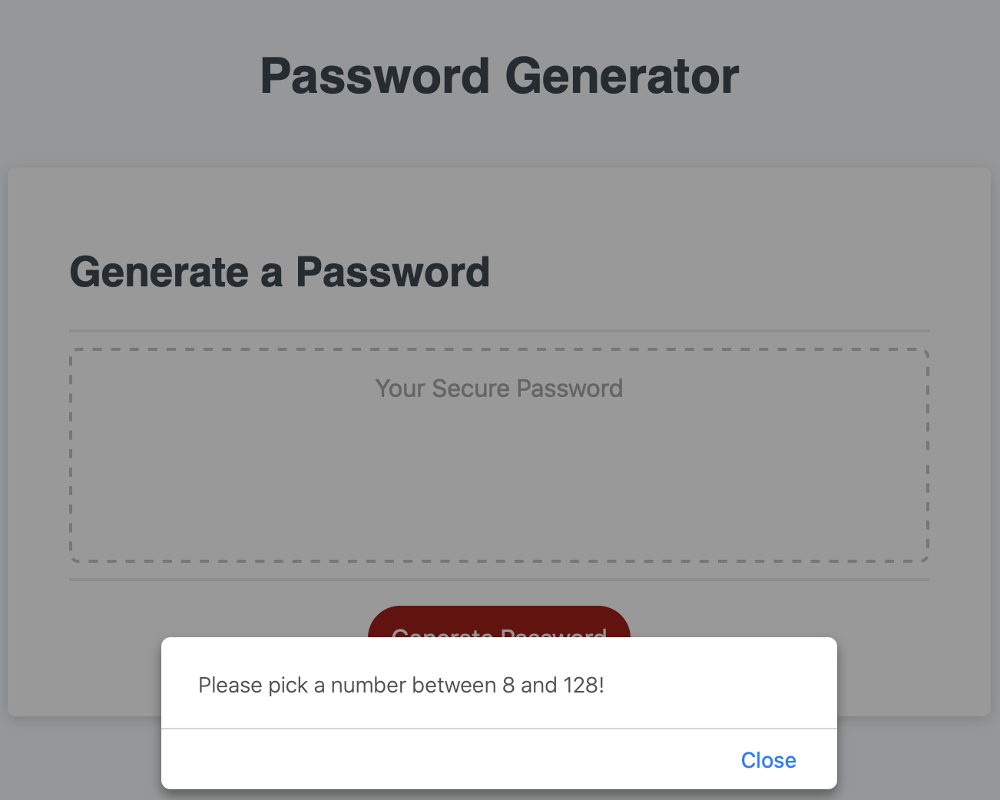
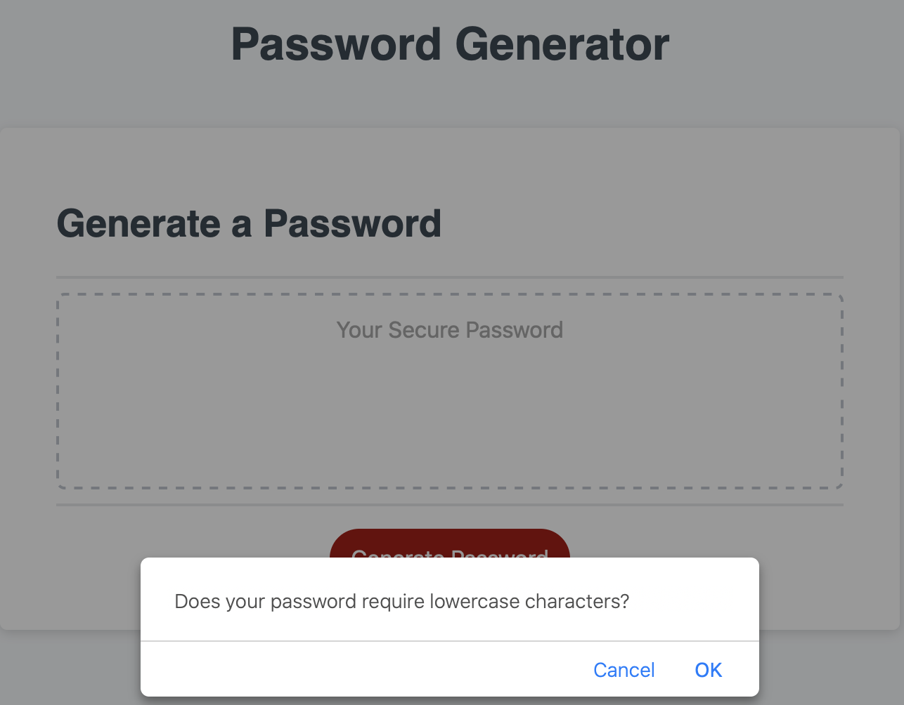
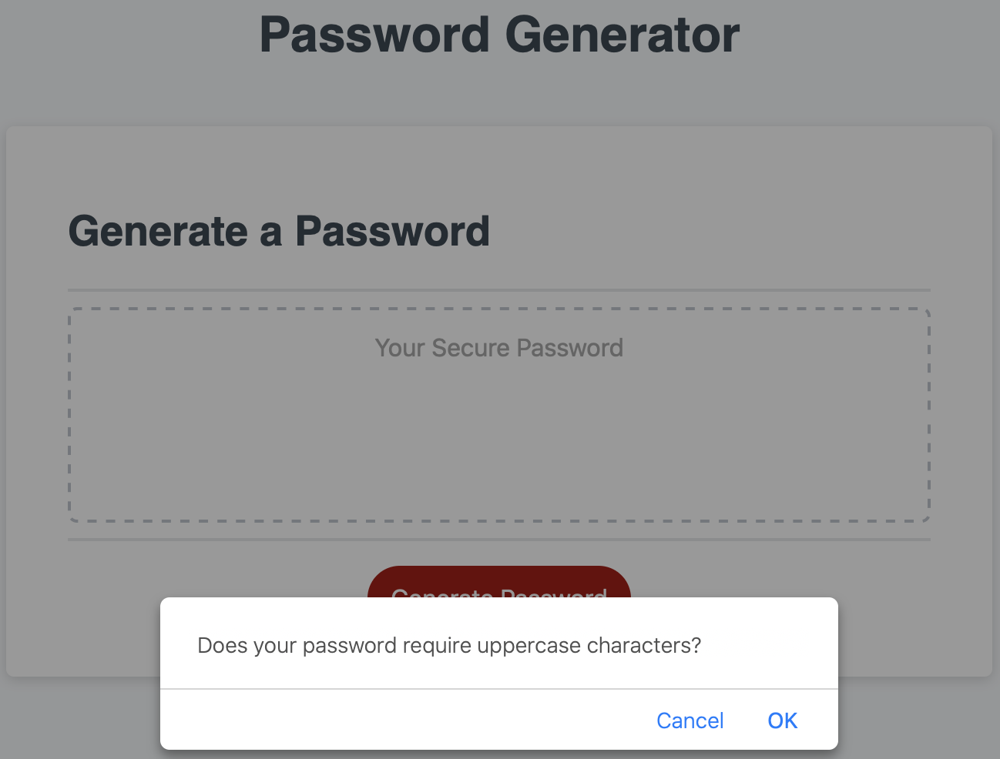
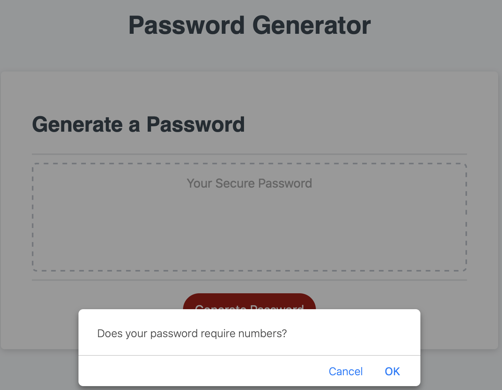
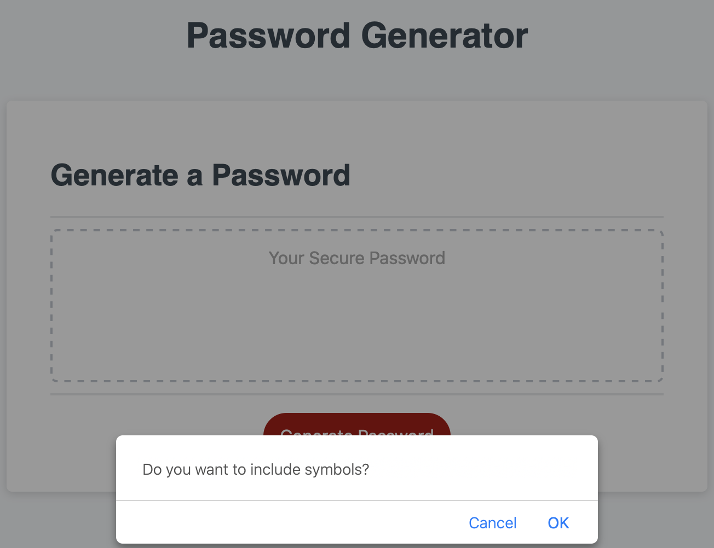
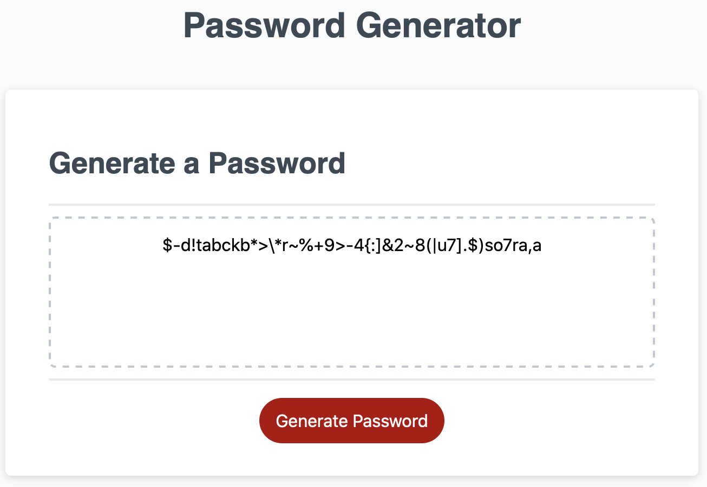

# passwordGenerator

Coding Bootcamp/03-JavaScript/Homework

## Links:

Github pages link: 'https://avpizarro.github.io/passwordGenerator/'

Github repository link: 'https://github.com/avpizarro/passwordGenerator.git'

### The user can generate a password by clicking a button:

### Choose a password length between 8 and 128 characters

### Pick again if the length is outside the required range

### Add lowercase characters

### Add uppercase characters

### Add numbers

### Add symbols

### Here is your password

